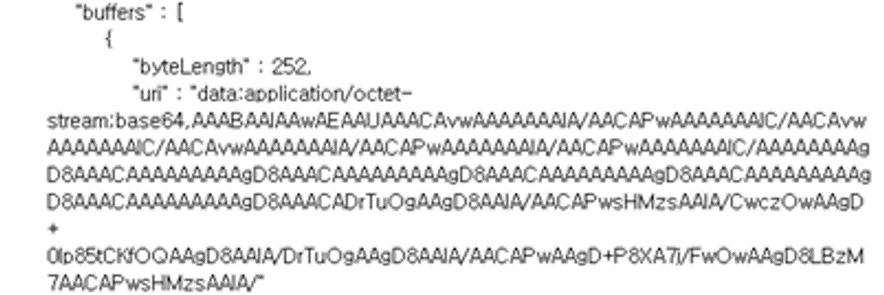
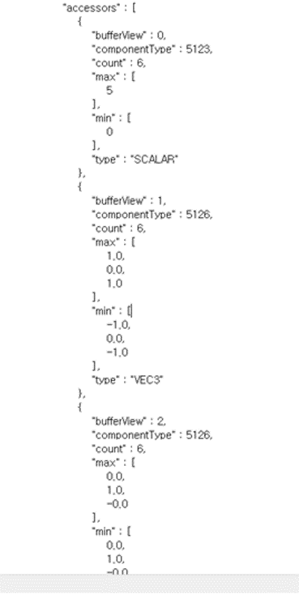
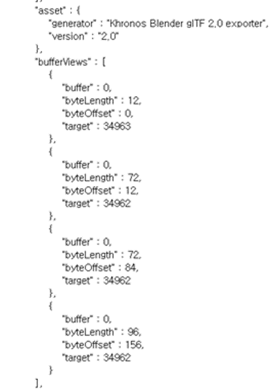

# gltfLoader

# gltfLoader
tinygltf를 활용한 간단한 gltfLoader프로그램 입니다.
질문사항은 jinyoung@kookmin.ac.kr로 메일 보내주세요

# gltfLoader 시작
git을 clone 받고 clone 받은 디렉토리에 아래의 파일이 존재하는지 확인합니다.
- tiny_gltf.h           #gltf load하게 해주는 라이브러리입니다.
- std_image_write.h     #tiny_gltf.h 빌드에 사용됩니다.
- std_image.h           #tiny_gltf.h 빌드에 사용됩니다.
- json.hpp              #tiny_gltf.h 빌드에 사용됩니다.
- gltfLoader.cpp        #우리가 사용하고 변경할 코드입니다.
- testTri.gltf          #테스트를 위한 gltf파일입니다.
- out.gltf              #make_buffer를 통해 만들어낸 gltf파일입니다.

확인 후 make를 통해 컴파일 합니다.
<pre><code> $ make </pre></code>

# gltf 구조 이해하기
gltf는 크로노스 그룹에서 만든 JSON기반의 3D scene 및 model 파일입니다.
gltf의 버전은 1.0과 2.0이 존재하지만 우리는 2.0을 사용합니다.
gltf의 더 자세한 내용은 https://github.com/KhronosGroup/glTF 를 참조하세요

위의  그림은 gltf파일의 구조도입니다.
gltf파일을 읽으면 위의 구조도를 참고하여 원하는 component로 접근하면 됩니다.

# gltfLoader 이해하기
gltfLoader에는 4가지의 함수가 존재합니다.
- loadModel
- dbgModel
- print_buffer
- make_buffers

## loadModel
gltf파일은 로드합니다. 로드의 성공 여부를 출력해 줍니다.

## dbgModel
gltf파일의 로드에 성공하였다면 gltf파일이 갖는 여러 속성들을 보여줍니다.
- 여러 Node들의 정보(카메라, lamp 등)
- Mesh의 정보
- mesh.primitives(idx).attributes(idx)를 통해 attributes
- attributes를 통해 POSITION, NORMAL, COLOR_0 등의 bufferview정보
- gltf파일의 정보들이 encoding된 uri정보

## print_buffer
gltf의 각 attribute마다 encoding된 byte데이터로 읽어 오기 때문에 이를 사람이 볼수 있는 float형으로 보여줍니다.

## make_buffers
gltf파일은 uri에 여러 attribute 정보들이 저장되기 때문에 vertex position이나 color등을 float형의 숫자로 그냥 넣어 줄수 없습니다.
이를 byte데이터로 변환하여 저장하기 위한 함수입니다.
gltfLoader.cpp내의 idx, vtx, color, normal의 정보를 바꾸시고 컴파일 후 실행하시면 맨 밑줄에 생성된 
<pre><code>data:application/octet-stream;base64,AAAAAAAAAA</pre></code>
같은 데이터를 복사하여 gltf파일에 uri에 붙여넣기합니다.

출력의 예시입니다.

붙여넣기 후 gltfLoader.cpp에서 입력한 idx, vtx, color, normal의 개수를 입력합니다.(기본적으로 vertex의 개수를 입력하시면 됩니다.)

마지막으로 bufferViews에서 byte데이터들의 offset과 length를 수정해 주면됩니다.
offset과 length는 실행시 출력의 uri위에 있고 순서는 idx, vtx, normal, color입니다.

# gltf Viewer
gltf파일은 https://gltf-viewer.donmccurdy.com/ 에서 열어볼수 있습니다.
