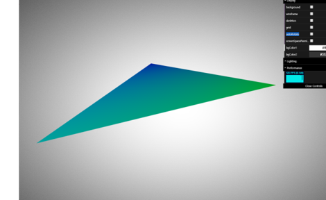

# gltfLoader

# gltfLoader
tinygltf를 활용한 간단한 gltfLoader프로그램 입니다.
질문사항은 jinyoung@kookmin.ac.kr로 메일 보내주세요

# gltfLoader 시작
git을 clone 받고 clone 받은 디렉토리에 아래의 디렉토리들을 확인하고 각각을 컴파일합니다.
- loader
- saver
- viewer

확인 후 make를 통해 컴파일 합니다.
<pre><code> $ make </code></pre>

# gltf 구조 이해하기
gltf는 크로노스 그룹에서 만든 JSON기반의 3D scene 및 model 파일입니다.
gltf의 버전은 1.0과 2.0이 존재하지만 우리는 2.0을 사용합니다.
gltf의 더 자세한 내용은 https://github.com/KhronosGroup/glTF 를 참조하세요

위의  그림은 gltf파일의 구조도입니다.
gltf파일을 읽으면 위의 구조도를 참고하여 원하는 component로 접근하면 됩니다.

# Tiny_gltf 이해하기
Tiny_gltf는 gltf파일을 파싱하는데 사용하는 라이브러리입니다.
github 주소는 https://github.com/syoyo/tinygltf 이곳입니다.
Tiny_gltf에서 아래의 헤더파일 4개를 받아와 사용합니다
- stb_image.h           
- stb_image_write.h
- json.hpp
- tiny_gltf.h

가장 중요한 파일은 tiny_gltf.h 파일이며 gltf파일을 읽고 파싱하는 기능을 포함하고 있습니다.

tinygltf::Model 객체를 생성하여 모델을 로드하면 gltf 트리 구조가 로드 됩니다.
모델의 로드는 loadModel함수로 정의해놨습니다.

# gltfLoader 이해하기
gltfLoader에는 3가지 프로그램이 존재합니다.
- loader
- saver
- viewer

## Loader
gltf 파일을 읽고 bytedata를 float형태로 바꾸어 출력해 줍니다.
gltf 파일 내의 정보들을 얻을 수 있습니다.

<pre><code> $ ./gltfLoader /gltf파일경로 </code></pre>

다음으로는 코드 설명입니다.
대표적으로 2개의 함수가 있습니다
- dbgModel
- print_buffer

### dbgModel
모델의 정보들을 출력해 줍니다. node -> mesh ->attribute 순으로 출력해줍니다.
attribute는 각 attribute의 세부 정보까지 출력해 주고 이를 위해 print_buffer함수를 사용합니다.
### print_buffer
attribute의 byte data를 사람이 이해할 수 있는 float이나 int형 등으로 바꾸어 출력해 줍니다.
gltf파일 내에 각 component(index, position 등)에서 componentType이 해당 component의 자료형이 되고 byteLength는 byte data의 길이, byteoffset은 해당 component의 byte data의 시작점입니다.

## Viewer
gltf파일을 읽고 보여주는 프로그램입니다.
<pre><code> $ ./gltfViewer /gltf파일경로 </code></pre>
를 실행시키면 해당 gltf모델이 보여집니다.
기존 실습코드인 camera 코드에서 발전 시켰으며 tinygltf viewer와 결합시킨 핵심 함수는 아래와 같습니다.
- loadModel
- bindModel
- bindMesh
- drawModel
- drawMesh

### loadModel
gltf모델을 로드하는 함수로 정상실행시 'Loaded glTF: 파일명'을 표시해줍니다.

<pre><code> 
bool loadModel(tinygltf::Model &model, const char *filename) {
  tinygltf::TinyGLTF loader;        //tiny_gltf내의 TinyGLTF 객체 선언

  bool res = loader.LoadASCIIFromFile(&model, &err, &warn, filename);   //TinyGLTF 객체의 LoadASCIIFromFile함수를 이용하여 gltf파일을 로드합니다.
</code></pre>

### bindModel

<pre><code> 
GLuint bindModel(tinygltf::Model &model) {
  std::map<int, GLuint> vbos;
  const tinygltf::Scene &scene = model.scenes[model.defaultScene];              //gltf파일을 로드하면 여러개의 scene이 존재할 수 있습니다. 현재 코드는 기본 scene만을 사용합니다.
  bindMesh(vbos, model, model.meshes[model.nodes[scene.nodes[0]].mesh]);        //기본 scene의 mesh를 binding하기 위해 bindmesh함수를 호출합니다.
</code></pre>
모델을 바인드 해주는 함수로 bindMesh를 호출하여 모델의 세부데이터를 binding해줍니다.

### bindMesh
Mesh에 position과 color값을 버텍스 쉐이더와 연결해줍니다.

<pre><code> 
if (attrib.first.compare("POSITION") == 0)
      {
        // 버텍스 쉐이더의 attribute 중 a_position 부분 활성화
        glEnableVertexAttribArray(loc_a_position);
        // 현재 배열 버퍼에 있는 데이터를 버텍스 쉐이더 a_position에 해당하는 attribute와 연결
        glVertexAttribPointer(loc_a_position, size, accessor.componentType,
                              accessor.normalized ? GL_TRUE : GL_FALSE,
                              byteStride, BUFFER_OFFSET(accessor.byteOffset));
      } 
</code></pre>

### drawModel
binding된 모델을 drawMesh를 호출하여 그려줍니다.

<pre><code> 
void drawModel(GLuint vao, tinygltf::Model &model) {
  glBindVertexArray(vao);

  const tinygltf::Scene &scene = model.scenes[model.defaultScene];          //gltf파일을 로드하면 여러개의 scene이 존재할 수 있습니다. 현재 코드는 기본 scene만을 사용합니다.
  drawMesh(model, model.meshes[model.nodes[scene.nodes[0]].mesh]);
</code></pre>

### drawMesh
glDrawElements를 호출하여 gltf모델을 그려줍니다.

<pre><code> 
void drawMesh(tinygltf::Model &model, tinygltf::Mesh &mesh) {
  for (size_t i = 0; i < mesh.primitives.size(); ++i) {
    tinygltf::Primitive primitive = mesh.primitives[i];
    tinygltf::Accessor indexAccessor = model.accessors[primitive.indices];

    glDrawElements(primitive.mode, indexAccessor.count,
                   indexAccessor.componentType,
                   BUFFER_OFFSET(indexAccessor.byteOffset));
  }
}
</code></pre>

디렉토리 내부의 viewer를 사용해도 되지만
https://gltf-viewer.donmccurdy.com/ 에 접속하여 웹에서도 gltf파일을 볼 수 있습니다.

## Saver
gltf 파일을 읽고 사용자가 지정한 데이터를 입력하면 입력한 데이터에 맞는 gltf모델을 생성하여 저장합니다.
사용자가 지정해야할 데이터는 vertexCount, index, vertexPosition, normal, color 등 입니다.

<pre><code> $ ./gltfSaver /gltf파일경로 </code></pre>

데이터를 입력하고 프로그램을 실행시키면 사용자가 입력한 모델의 정보가 out.gltf로 저장됩니다.

saver를 통해 생성한 모델입니다.

